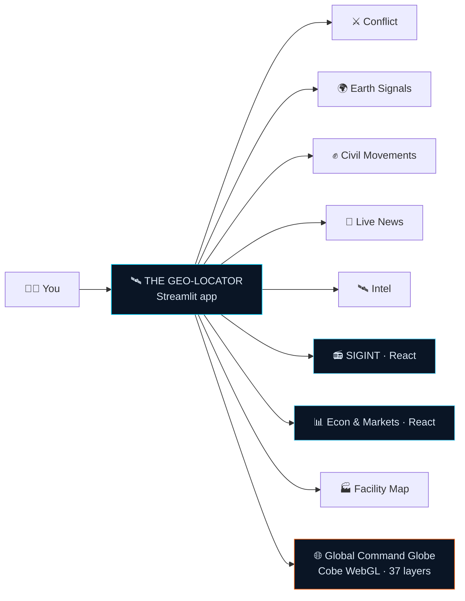
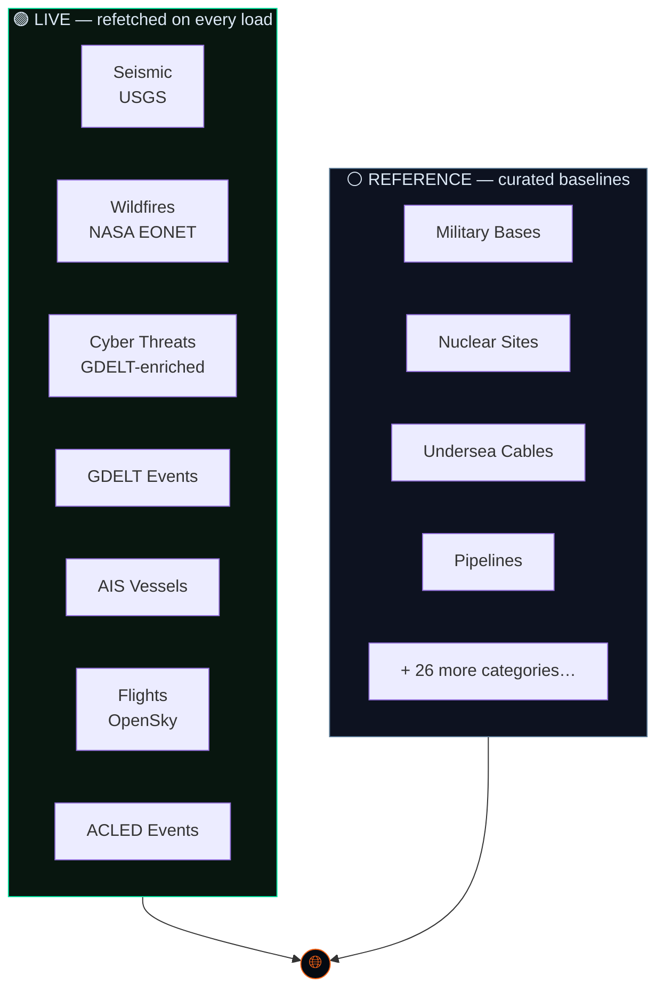

<div align="center">

# 🌐 THE GEO-LOCATOR
### v8

**A real-time global intelligence dashboard — conflicts, signals intelligence, live markets, earth events, and geopolitical risk, in one command console.**


</div>

---

## 🖥 What you're looking at



Only the **active tab's code runs** on any given interaction — a v8 fix for a Streamlit quirk where `st.tabs()` normally re-executes every tab's API calls on every click, no matter which one you're looking at.

---

## 🌐 Global Command Globe

The centerpiece: a rotating 3D WebGL globe ([Cobe](https://cobe.vercel.app/)) with **37 toggleable data layers**, click-to-pin sticky notes, and a hard split between what's genuinely live and what's a curated reference baseline.



**Interactions:**
- 🖱 **Drag** to rotate · **hover** any dot for a quick preview
- 📌 **Click** a marker to pin a sticky note (title + category + key details) — multiple notes can stay open at once, each closable individually
- 🎛 37 layers grouped into 7 sidebar categories: Core, Intelligence, Infrastructure, Military & Traffic, Live Intelligence, Human & Social, Natural & Climate

---

## 📊 Feature Map

| Tab | Highlights | Stack |
|---|---|---|
| ⚔ **Conflict Dashboard** | Live-duration tracker per conflict, GDELT news overlay, casualty/timeline charts | Streamlit + Plotly |
| 🌍 **Earth Signals** | USGS earthquakes, NASA EONET, Kp-index space weather | Streamlit + pydeck |
| ✊ **Civil Movements** | Global protest/unrest tracking | Streamlit |
| 📡 **Live News** | Live TV embeds, RSS aggregation | Streamlit + `hls.js` |
| 🛰 **Intel Dashboard** | GPS jamming, cyber threats, country instability index | Streamlit |
| 📻 **SIGINT** | 12 live-polling intel panels (COMINT/ELINT/MASINT/cyber/seismic/KP) | **React 18**, precompiled |
| 📊 **Economic & Markets** | 16 panels: indices, forex, crypto, sanctions, pizza index, supply chain | **React 18**, precompiled |
| 🏭 **Facility Map** | Refineries, SPR sites, satellite tile imagery | Streamlit + pydeck |
| 🌐 **Global Command Globe** | 37-layer rotating 3D globe, click-to-pin sticky notes | Cobe (WebGL canvas) |

> **Why React only on two tabs?** SIGINT and Econ build entire UIs from JSON payloads — exactly what React is for. Everywhere else, plain Streamlit/pydeck/Plotly is simpler and better-suited, so that's what's used. See [Architecture notes](#-architecture-notes).

---

## 🚀 Quick Start

```bash
pip install -r requirements.txt
streamlit run app.py
```

Python 3.9+. Runs fully without any API keys — optional keys unlock higher-quality data for four sources (see [Configuration](#-configuration-all-optional)).

> ⚠️ **Repo requirement:** `app.py` and `data_constants.py` must live in the same directory and be committed together — `app.py` does `from data_constants import *` at startup.

---

## 📁 Repository Structure

```
.
├── app.py                # Main app — UI, tabs, live fetchers, globe, React dashboards
├── data_constants.py     # Static reference datasets (pure data, no imports)
├── requirements.txt      # Python dependencies
└── README.md
```

---

## ⚙️ Configuration (all optional)

Fully functional out of the box on public, keyless endpoints. Add these in `.streamlit/secrets.toml` (local) or **App settings → Secrets** (Streamlit Cloud) to unlock more:

```toml
ACLED_KEY = "..."            # + ACLED_EMAIL — live ACLED conflict events
AISSTREAM_KEY = "..."        # full live AIS vessel feed
SUPABASE_URL = "..."         # + SUPABASE_KEY — persisted history/cache backend
ALERT_WEBHOOK_URL = "..."    # Slack/Discord webhook — plain HTTP, no AI involved
```

| Secret | Unlocks | Without it |
|---|---|---|
| `ACLED_KEY` + `ACLED_EMAIL` | Live ACLED conflict events | Falls back to GDELT scraping |
| `AISSTREAM_KEY` | Full live AIS vessel feed | Reduced/static set |
| `SUPABASE_URL` + `SUPABASE_KEY` | Persisted history/cache backend | In-session cache only |
| `ALERT_WEBHOOK_URL` | 🔔 Push alerts (critical conflicts, Kp≥5 storms) | Sidebar shows "🔕 off" |

---

## 🏗 Architecture Notes

```mermaid
flowchart LR
    A["Click anywhere<br/>in the app"] --> B{"Which tab is<br/>active?"}
    B -->|"only this one runs"| C["Active tab's<br/>fetch calls"]
    B -.->|"skipped entirely"| D["7 inactive tabs<br/>(v7: these ALL ran too)"]
    C --> E["st.cache_data<br/>60–90s TTL"]
    E --> F["Render"]

    style D stroke-dasharray: 5 5,color:#5a7a95
    style C fill:#08160f,stroke:#00e5a0
```



- **Lazy tab loading** — `st.tabs()` normally executes every tab's code on every rerun; a session-state selector fixed that.
- **Precompiled React** — SIGINT & Econ JSX is compiled to plain JS *ahead of time* (via Babel/Node), not transpiled live in-browser. Removes a multi-MB Babel-Standalone dependency and was the fix for slow/failed loads on the largest tab.
- **Caching & fallbacks** — every live fetch has a per-source TTL and a static-baseline fallback, so a flaky third-party API degrades gracefully.
- **Logging** — high-traffic fetcher failures are logged via Python's `logging` module instead of failing silently.
- **Module split (phase 1)** — static reference datasets live in `data_constants.py`; fetchers/UI remain in `app.py`.

---

---

## 🧰 Tech Stack

<div align="center">

| Layer | Technology | Used for |
|---|---|---|
| App framework |  | Tabs, sidebar, widgets, session state, caching |
| Language |  | Fetchers, data wrangling, orchestration |
| Maps |  | Facility Map, Earth Signals map |
| 3D globe |  | Global Command Globe (37-layer rotating globe) |
| Charts |  | Timelines, casualty/media-bias charts |
| Dashboards |  | SIGINT & Economic tabs (precompiled, no runtime Babel) |
| Data |   | DataFrames, numeric ops on live feeds |
| Networking |  | USGS, GDELT, EONET, ACLED, AIS, Yahoo, CoinGecko, NOAA, Supabase |
| Video |  | Live TV stream embeds |
| Images |  | Satellite tile mosaic stitching |
| Persistence (optional) |  | History/cache backend via REST API |
| Alerts (optional) |  | Webhook push alerts — plain HTTP, no AI |

</div>

### External data sources

<div align="center">

        

</div>

---

## 🧭 Known Limitations

- Curated baselines (military postures, nuclear-site status, instability index) are a point-in-time snapshot, not continuously verified.
- "SIGINT"-flavored panels (MASINT/ELINT/COMINT) are derived/illustrative signal blends, not real classified feeds.
- The globe's line-shaped datasets (cables, pipelines, trade routes) render as endpoints, not true connecting arcs — a real trade-off of the WebGL-canvas approach vs. the old pydeck `ArcLayer`.
- Free-tier public APIs (GDELT, ACLED without a key, EONET, USGS) are rate-limited under heavy concurrent use.

---

## 📄 License

Released under the [MIT License](LICENSE) — free to use, modify, and distribute, including commercially, with attribution and no warranty.

<div align="center">

---

*Built with Streamlit · pydeck · Plotly · React · Cobe*

</div>
